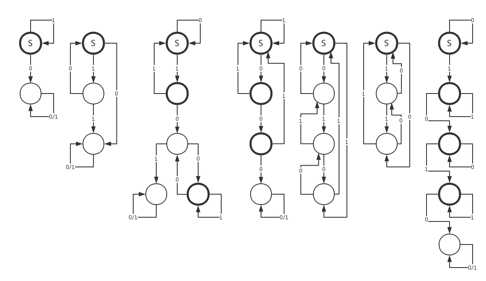

# RNN to DFA

This is a project aiming to extract a minimal DFA from a well-trained RNN model.

[TOC]

## The Tomita Grammars

The Tomita grammars are a set of widely used benchmark grammars in the problem of grammar inference. It contains 7 different regular grammars defined upon the binary alphabet , as shown below.

```
Tomita 1    1*
Tomita 2    (10)*
Tomita 3    all strings without containing odd number of consecutive 0's after odd number of consecutive 1's
Tomita 4    all strings without containing 3 consecutive 0's (000)
Tomita 5    all strings with even numbers of 0's and 1's
Tomita 6    all strings satisfying #(0)-#(1) = 3n (n=...,-1,0,1,...)
Tomita 7    1*0*1*0*
```

The corresponding minimal DFA's are shown below. The number of states are less than 5. States with thick border represent ACC states, while states with thin border represent REJ states. States with an "S" are starting staes of each DFA. The DFA's are equivalent to Tomita 1 to Tomita 7, from left to right.



The 7 DFA's are defined in ```./tomita/tomita.py```, which are able to classify a given sequence (ACC/REJ) and generate sequences with their corresponding ACC/REJ labels. As the 7 datasets are large to some degree, and they are able to be automatically generated, they are excluded from this repo. **REMEMBER TO GENERATE THE DATASET BEFORE TRAINING THE RNN MODELS.** Run ```python3 generator.py``` under the directory ```./tomita/``` to generate the 7 datasets of the Tomita grammars. 

## RNNs Trained on The Tomita Grammars

Sequence datasets of all Tomita grammars are generated, with the max length of 20. RNN models (RNN/LSTM/GRU) with a 128 hidden-state width are trained on the datasets. The accuracy results are shown in the [table](#table_rnn_acc).

<div id="table_rnn_acc"> </div>
<table>
    <tr>
        <td> Tomita </td> <td> State # </td> <td> RNN Type </td> <td> Train Acc % </td> <td> Test Acc % </td>
    </tr>
    <tr>
        <td rowspan="3"> Tomita 1 </td>
        <td rowspan="3"> 2 </td>
        <td> RNN </td> <td> ? </td> <td> ? </td>
    </tr>
    <tr>
        <td> GRU </td> <td> 99.9+ </td> <td> 100 </td>
    </tr>
    <tr>
        <td> LSTM </td> <td> ? </td> <td> ? </td>
    </tr>
    <tr>
        <td rowspan="3"> Tomita 2 </td>
        <td rowspan="3"> 3 </td>
        <td> RNN </td> <td> ? </td> <td> ? </td>
    </tr>
    <tr>
        <td> GRU </td> <td> 99.9+ </td> <td> 100 </td>
    </tr>
    <tr>
        <td> LSTM </td> <td> ? </td> <td> ? </td>
    </tr>
    <tr>
        <td rowspan="3"> Tomita 3 </td>
        <td rowspan="3"> 5 </td>
        <td> RNN </td> <td> ? </td> <td> ? </td>
    </tr>
    <tr>
        <td> GRU </td> <td> 99.9+ </td> <td> 99.9+ </td>
    </tr>
    <tr>
        <td> LSTM </td> <td> ? </td> <td> ? </td>
    </tr>
    <tr>
        <td rowspan="3"> Tomita 4 </td>
        <td rowspan="3"> 4 </td>
        <td> RNN </td> <td> ? </td> <td> ? </td>
    </tr>
    <tr>
        <td> GRU </td> <td> 99.9+ </td> <td> 99.9+ </td>
    </tr>
    <tr>
        <td> LSTM </td> <td> ? </td> <td> ? </td>
    </tr>
    <tr>
        <td rowspan="3"> Tomita 5 </td>
        <td rowspan="3"> 4 </td>
        <td> RNN </td> <td> ? </td> <td> ? </td>
    </tr>
    <tr>
        <td> GRU </td> <td> 83.3 </td> <td> 50.1 </td>
    </tr>
    <tr>
        <td> LSTM </td> <td> ? </td> <td> ? </td>
    </tr>
    <tr>
        <td rowspan="3"> Tomita 6 </td>
        <td rowspan="3"> 3 </td>
        <td> RNN </td> <td> ? </td> <td> ? </td>
    </tr>
    <tr>
        <td> GRU </td> <td> 66.7 </td> <td> 66.7 </td>
    </tr>
    <tr>
        <td> LSTM </td> <td> ? </td> <td> ? </td>
    </tr>
    <tr>
        <td rowspan="3"> Tomita 7 </td>
        <td rowspan="3"> 5 </td>
        <td> RNN </td> <td> ? </td> <td> ? </td>
    </tr>
    <tr>
        <td> GRU </td> <td> 99.9+ </td> <td> 99.9+ </td>
    </tr>
    <tr>
        <td> LSTM </td> <td> ? </td> <td> ? </td>
    </tr>
</table>

Only those models with 99.9%" /> and 99.9%" /> are referred as models who have learned the grammar well. Therefore the RNN2DFA extraction is applied only on these models.